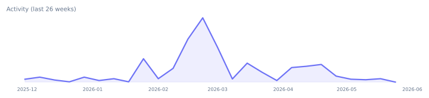

# 👋 Hello, I’m Silas Nevstad

<b>Software engineer</b> · <b>solopreneur</b> · backend / full-stack / ML

  
  
  
  
  
  

<b>Languages</b> 

 <b>Frontend Frameworks</b> 

 <b>Backend Frameworks</b> 

 <b>Machine Learning</b> 

 <b>Infrastructure & Platforms</b> 

  
  
  

  

  
<b>Current Projects</b>

  
  
  

